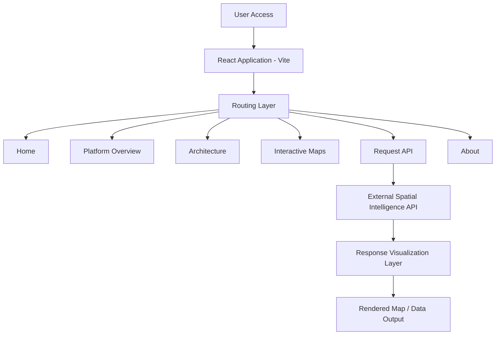
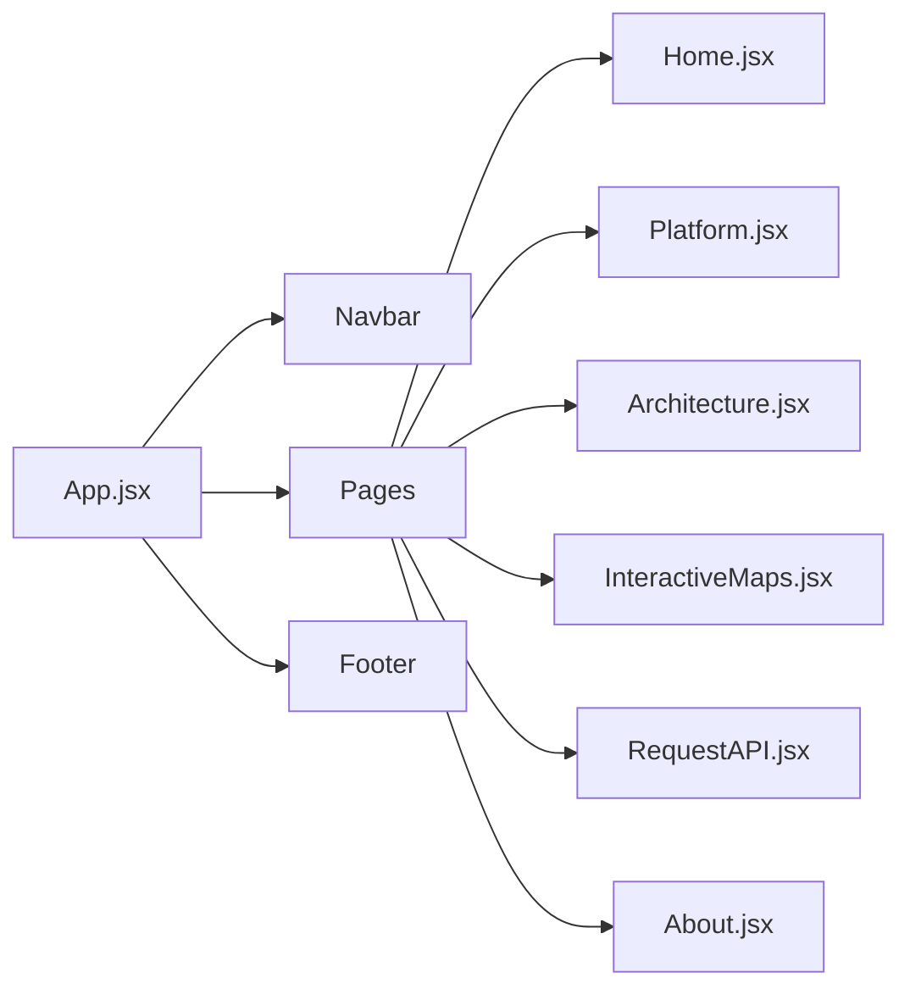

<p>
  
</p>

<h1 style="margin-top:0;">
ALKF – Integrated Geospatial Site Analysis Platform
</h1>

<hr>

# Executive Overview

**ALKF – Integrated Geospatial Site Analysis Platform** is a structured urban intelligence interface engineered to present professional-grade spatial feasibility analysis through a modular and scalable frontend architecture.

The platform provides a controlled, enterprise-level visualization environment for:

- Urban Site Intelligence Presentation  
- Interactive Spatial Mapping  
- Infrastructure Context Visualization  
- Architectural & Planning Dashboards  
- API Request Orchestration  
- Enterprise-Ready Deployment  

Designed for urban planners, architects, developers, and infrastructure consultants.

---

# System Architecture

## End-to-End Frontend Flow



---

## UI Component Hierarchy



---

# Repository Structure

```
ALKF-Integrated-Geospatial-Site-Analysis-Platform/
│
├── public/
│   ├── logo.png
│   ├── logo1.PNG
│   ├── logo3.PNG
│   ├── map.png
│   ├── video1.MP4
│   └── video2.mp4
│
├── src/
│   ├── components/
│   │   ├── Navbar.jsx
│   │   └── Footer.jsx
│   │
│   ├── pages/
│   │   ├── Home.jsx
│   │   ├── Platform.jsx
│   │   ├── Architecture.jsx
│   │   ├── InteractiveMaps.jsx
│   │   ├── RequestAPI.jsx
│   │   └── About.jsx
│   │
│   ├── App.jsx
│   ├── main.jsx
│   └── index.css
│
├── index.html
├── package.json
├── package-lock.json
├── tailwind.config.js
├── postcss.config.js
├── vite.config.js
├── LICENSE.md
└── .gitignore
```

---

# Core Platform Modules

---

## 1. Home Module

**Purpose:**  
Enterprise landing interface presenting ALKF positioning and spatial intelligence capability.

**Includes:**
- Hero architecture section  
- Spatial visualization previews  
- Strategic platform messaging  
- Gateway navigation  

---

## 2. Platform Overview Module

**Purpose:**  
High-level explanation of spatial system capabilities.

**Features:**
- Spatial analytics positioning  
- Infrastructure modelling summary  
- Environmental intelligence outline  
- Feasibility assessment framing  

---

## 3. Architecture Module

**Purpose:**  
Technical explanation of platform logic and infrastructure design.

**Includes:**
- Processing flow diagrams  
- System stack breakdown  
- Modular frontend structure  
- Cloud deployment readiness  

---

## 4. Interactive Maps Module

**Purpose:**  
Dedicated spatial visualization interface.

**Features:**
- Dynamic map rendering  
- Spatial layer visualization  
- Context overlays  
- Infrastructure density display  
- Urban analytics preview  

Architecturally isolated for scalability and performance.

---

## 5. Request API Module

**Purpose:**  
Frontend orchestration layer for backend spatial intelligence engine.

**Functions:**
- Accept lot / site input  
- Send request to spatial API  
- Process structured response  
- Render visualization output  

---

## 6. About Module

**Purpose:**  
Enterprise positioning and mission statement.

**Focus Areas:**
- Urban intelligence mission  
- Infrastructure-grade philosophy  
- Architectural modelling orientation  
- Professional audience targeting  

---

# Technology Stack

| Layer | Technology |
|-------|------------|
| Build Tool | Vite |
| Frontend Framework | React |
| Styling System | Tailwind CSS |
| Routing | React Router |
| Media Handling | HTML5 Native |
| Deployment Ready | Vercel / Netlify / Render |

---

# Styling Architecture

### Tailwind CSS Configuration

- Utility-first styling system  
- Structured spacing grid  
- Enterprise-neutral color palette  
- Responsive breakpoints  
- Production-optimized builds  

### Design Philosophy

- Clean light theme  
- Architectural typography hierarchy  
- Infrastructure-grade spacing logic  
- No startup-style UI  
- No unnecessary animation overload  

---

# Build & Development

## Install Dependencies

```bash
npm install
```

## Run Development Server

```bash
npm run dev
```

## Production Build

```bash
npm run build
```

## Preview Production Build

```bash
npm run preview
```

---

# Deployment Strategy

Optimized for static hosting environments:

- Vercel  
- Netlify  
- Render Static  
- Cloudflare Pages  

No server-side rendering required.

---

# Performance Optimization

- Vite-based optimized bundling  
- Static asset compression  
- Modular page separation  
- Clean routing architecture  
- Production-ready Tailwind purge  
- Lightweight media handling  

---

# Implementation Stages

| Stage | Description | Status |
|--------|------------|--------|
| Stage 1 | React Core Architecture | ✅ Completed |
| Stage 2 | Tailwind Integration | ✅ Completed |
| Stage 3 | Modular Routing System | ✅ Completed |
| Stage 4 | Interactive Maps Isolation | ✅ Completed |
| Stage 5 | API Request Interface | ✅ Completed |
| Stage 6 | Enterprise UI Refinement | ✅ Completed |
| Stage 7 | Static Deployment Ready | ✅ Completed |

---

# Engineering Significance

This platform demonstrates:

- Modular React system design  
- Structured enterprise UI architecture  
- Clean separation of visualization and routing logic  
- Scalable frontend foundation for geospatial systems  
- Cloud-ready static deployment configuration  

---

# Future Enhancements

- Authentication & role-based access  
- Dynamic layer toggling system  
- Real-time spatial analytics integration  
- PDF export module  
- Admin dashboard interface  
- Micro-frontend expansion  
- SaaS configuration layer  

---

# License

Refer to `LICENSE.md` for licensing details.

---

© ALKF – Integrated Geospatial Intelligence Platform
